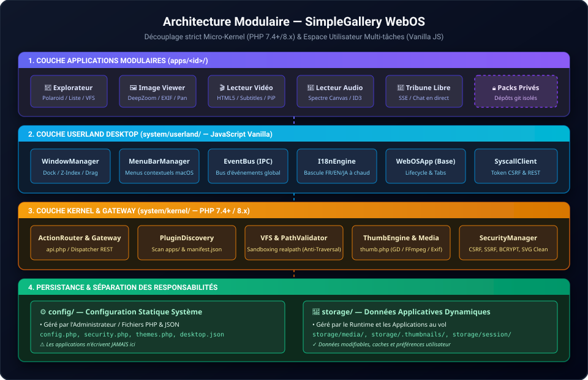

# 📖 Documentation Technique — SimpleGallery WebOS

Bienvenue dans la documentation technique complète de **SimpleGallery WebOS**. 
Ce document présente une vue d'ensemble du système et sert de portail vers les guides d'architecture détaillés.

---

## 📑 Guides Thématiques Détaillés

Pour approfondir un sujet spécifique, consultez les guides dédiés dans le dossier [`docs/`](docs/) :

| Guide | Contenu & Objectifs |
|---|---|
| 🏗️ **[Architecture Système](docs/architecture.md)** | Micro-Kernel PHP, VFS, PluginDiscovery, séparation stricte `config/` vs `storage/`. |
| 🛠️ **[Création d'Applications](docs/apps-guide.md)** | Guide pas-à-pas, schéma `manifest.json`, classe de base `WebOSApp`, WebOSToolkit UI, i18n réactif. |
| 🔐 **[Sécurité & Permissions](docs/security.md)** | CSRF, SSRF, sandboxing, matrice des droits et **distinction streaming en ligne (`raw=1`) vs téléchargement direct (`download=1`)**. |
| 🔒 **[Modules Métier & Dépôts Privés](docs/private-extensions.md)** | Intégration de packs privés sans toucher au core, `.gitignore`, déclaration `"enabled_by_default": false`. |

---



## 📊 Schémas d'Architecture Vectoriels (SVG)

Le projet inclut une collection complète de schémas vectoriels SVG interactifs et haute définition :

| Schéma SVG | Document Associé | Sujet Illustré |
|---|---|---|
| [**`architecture.svg`**](docs/assets/architecture.svg) | [docs/architecture.md](docs/architecture.md) | Découplage Micro-Kernel PHP vs Userland JS (Desktop, WindowManager, Syscalls). |
| [**`vfs-media-pipeline.svg`**](docs/assets/vfs-media-pipeline.svg) | [docs/architecture.md](docs/architecture.md) | Pipeline VFS, cache `storage/.thumbnails`, workers GD/FFmpeg, flux inline vs direct. |
| [**`security-flow.svg`**](docs/assets/security-flow.svg) | [docs/security.md](docs/security.md) | Passerelle de sécurité, validation CSRF/SSRF, distinction visionnage `raw=1` vs téléchargement `download=1`. |
| [**`app-lifecycle.svg`**](docs/assets/app-lifecycle.svg) | [docs/apps-guide.md](docs/apps-guide.md) | Cycle de vie d'une application : découverte, chargement, instanciation, montage UI, gestion mémoire. |
| [**`private-plugins.svg`**](docs/assets/private-plugins.svg) | [docs/private-extensions.md](docs/private-extensions.md) | Stratégie multi-dépôts, isolation des secrets et modules métier privés (ex: FFS). |

---

## 🌟 Principes Fondamentaux du Système

### 1. Zéro Dépendance Lourde & Vitesse Maximale
- **PHP 7.4+ / PHP 8.x natif** : Aucun ORM, aucun framework lourd, aucune base de données obligatoire.
- **JavaScript Vanilla Pur** : Gestionnaire de fenêtres multi-tâches, dock, barre de menus façon macOS et toolkit UI construits en JS natif moderne (zéro jQuery, zéro React).
- **Plug & Play** : Déposez vos dossiers de médias dans `storage/media/` : ils sont indexés, géolocalisés et prêts à être explorés instantanément.

### 2. Séparation `config/` vs `storage/`
- **`config/`** : Configuration statique définie par l'administrateur (`config.php`, `security.php`, `mime_types.php`, `themes.php`).
- **`storage/`** : Données dynamiques créées au runtime (`storage/.thumbnails/`, `storage/session/`, `storage/disabled_apps.json`, `storage/autostart.json`).
- *Règle absolue* : Une application ne doit jamais écrire dans `config/`.

### 3. Cycle de Vie d'une Application WebOS
Toutes les applications étendent la classe `WebOSApp` (`window.sys.App`) :

```javascript
class MonApp extends (window.sys && window.sys.App || window.WebOSApp) {
  constructor() {
    super({
      id: 'mon-app',
      title: 'apps.mon-app.title',
      icon: '⚡',
      width: 720,
      height: 480
    });
  }

  onInit() { /* Initialisation unique */ }
  onOpen() { /* Ouverture de la fenêtre */ }
  onClose() { /* Nettoyage automatique */ }
  renderTab(tabId) { return '<div>Contenu de l\'onglet</div>'; }
}

if (window.sys && window.sys.appManager) {
  window.sys.appManager.register(new MonApp());
}
```

---

## 🧭 Points d'Entrée & Routage

```text
HTTP Request
     │
     ├──► index.php                    (Shell HTML du bureau WebOS)
     ├──► system/endpoints/api.php     (Gateway REST/Syscall avec contrôle CSRF)
     ├──► system/endpoints/thumb.php   (Distribution des médias: inline raw=1 ou attachment download=1)
     ├──► system/endpoints/archive.php (Création d'archives ZIP/TAR en streaming)
     └──► apps/<id>/api.php            (Endpoints backend optionnels dédiés à chaque application)
```

---

## 🧪 Banc d'Essai & Tests Unitaires

SimpleGallery intègre une suite de tests complète (sécurité et fonctionnalités) :

```bash
# Lancer l'intégralité de la suite de tests
php tests/run_tests.php
```

La suite valide automatiquement l'isolation VFS, la protection CSRF, le blocage SSRF, la désinfection SVG, la syntaxe des templates PHP et la découverte dynamique des applications.

---

## 📜 Règles de Développement Impératives

1. **Pas de `fetch()` direct** : Utilisez toujours `this.api.get()` ou `this.api.post()` pour bénéficier de la gestion automatique des tokens CSRF.
2. **Pas de repli hardcodé dans `this.t()`** : N'écrivez jamais `this.t('key') || 'Fallback'`. Laissez le moteur retourner la clé pour repérer immédiatement les traductions manquantes.
3. **Stockage isolé** : Utilisez `this.storage.get()` et `this.storage.set()` plutôt que `localStorage` brut pour éviter les collisions de clés entre applications.
4. **Souscriptions sécurisées** : Utilisez `this.subscribe('event', callback)` pour que les écouteurs soient automatiquement nettoyés lors de la fermeture de la fenêtre.
