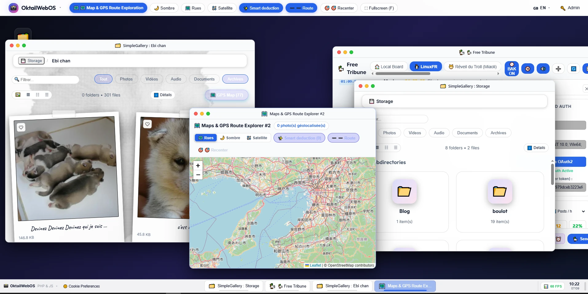

# SimpleGallery WebOS 🚀

**SimpleGallery** est à la fois une galerie multimédia plug-and-play ultra-rapide et un **environnement WebOS moderne et modulaire** conçu en **PHP 7.4+ / PHP 8+ et JavaScript Vanilla pur** (zéro framework lourd, zéro dépendance complexe, zéro base de données obligatoire).

Le principe fondamental d'origine reste intact : **pour publier de nouveaux médias (photos, vidéos, musique, documents, archives), il suffit simplement de les déposer dans n'importe quel dossier sur le serveur.**

---



## 🌟 Fonctionnalités Principales

### 🖥️ 1. Environnement de Bureau WebOS (Style macOS / Modern Desktop)
- **Gestionnaire de Fenêtres Multi-Tâches (`WindowManager`)** : Déplacez, redimensionnez, maximisez, réduisez dans le dock et empilez vos fenêtres avec gestion fluide du `z-index`.
- **Barre Supérieure Contextuelle (`MenuBarManager`)** : Menu dynamique adapté à l'application active au premier plan, horloge système, statut et sélecteur de langue instantané.
- **Dock & Barre des Tâches** : Accès rapide aux applications favorites, restauration de fenêtres et indicateurs de processus actifs.
- **Raccourcis & Personnalisation du Bureau** : Choix du fond d'écran (dégradés, motifs, images personnalisées), disposition en grille et thèmes dynamiques.
- **Internationalisation Complète (i18n)** : Interface traduite en **Français (FR)**, **Anglais (EN)** et **Japonais (JA)** avec **basculement réactif en temps réel** sans rechargement de page.

---

### 📂 2. Suite Complète d'Applications Intégrées (`apps/`)

| Application | Icône | Description & Capacités |
|---|:---:|---|
| **Explorateur de Fichiers** | 📁 | Navigation double volet, fil d'Ariane, tri, recherche en direct, sélection multiple, téléversement par glisser-déposer, modes **Polaroid 600**, **Grille Moderne**, **Liste** et **Compact**. |
| **Visionneuse d'Images** | 🖼️ | Moteur de zoom profond (*Deep Zoom* jusqu'à 10x), déplacement panoramique (*Pan*), rotation 90°, filtres colorimétriques et panneau d'inspection des métadonnées EXIF. |
| **Lecteur Vidéo HTML5** | 🎬 | Lecteur vidéo complet avec gestion des sous-titres (`.vtt`, `.srt`), vitesse de lecture (0.25x à 2x), mode cinéma, *Picture-in-Picture* (PiP) et capture instantanée. |
| **Lecteur Audio & Musique** | 🎵 | Lecteur musical avec analyseur de spectre / onde sonore dynamique en temps réel (*Canvas Visualizer*), pochettes et tags ID3, listes de lecture et lecture aléatoire. |
| **Lecteur & Éditeur de Documents** | 📄 | **PDF** (rendu vectoriel PDF.js avec pagination), **Markdown** (visionneuse et éditeur scindé en direct), **Éditeur de Code Source** (coloration syntaxique Prism.js pour 50+ langages). |
| **Gestionnaire d'Archives** | 📦 | Exploration directe du contenu des archives ZIP, extraction de fichiers et création d'archives à la volée. |
| **Cartes & Géolocalisation** | 🗺️ | Carte interactive du monde (Leaflet / OpenStreetMap) avec regroupement automatique par clusters (*Clustering*) des photos géotaggées par GPS EXIF. |
| **Tribune Libre** | 💬 | Espace de discussion communautaire en direct avec support des raccourcis clavier, téléversement de médias temporaires et flux temps réel. |
| **Moniteur Système** | 📊 | Supervision en temps réel des ressources serveur, mémoire PHP, espace disque, caches et diagnostics de stockage. |
| **Suite de Jeux Rétro** | 🎮 | **8 Dames** (solveur procédural par backtracking), **Foot Pong** (physique rétro 1v1 avec IA), **Tours de Hanoï** (solveur animé), **Netwalk** (connexion de réseau), **Konquest** et **JDR**. |

---

## ⚡ Installation & Démarrage Rapide

### Prérequis
- **PHP 7.4+** ou **PHP 8.0+** (extensions recommandées : `gd`, `exif`, `fileinfo`, `zip`).
- Optionnel : **FFmpeg** pour l'extraction automatique des miniatures de vidéos.

### 1. Démarrage Local Immédiat
Lancez simplement le script de démarrage local inclus :

```bash
./start.sh
# Ou en spécifiant un port particulier :
./start.sh 8080
```
Ouvrez ensuite `http://localhost:8080` dans votre navigateur.

---

### 2. Déploiement sur Serveur Web (Apache, Nginx, Caddy)
1. Déposez l'ensemble des fichiers du projet dans la racine de votre hébergement web (`public_html` ou `/var/www/html/SimpleGallery`).
2. Accordez les permissions d'écriture nécessaires au serveur web :
   ```bash
   chown -R www-data:www-data /var/www/html/SimpleGallery
   chmod -R 775 /var/www/html/SimpleGallery
   ```
3. Initialisez le mot de passe d'administration en ligne de commande :
   ```bash
   php bin/set_admin_password.php "VotreMotDePasseSecret"
   ```
4. Déposez vos dossiers de photos et médias dans `storage/media/` : ils sont immédiatement détectés !

---

## 🔐 Mode Administration, Sécurité & Droits d'Accès

- **Authentification Robuste** : Mot de passe haché par algorithme BCRYPT stocké de manière sécurisée.
- **Protection CSRF Globale** : Toutes les requêtes d'écriture et modifications exigent un jeton de session anti-CSRF valide.
- **Isolation du Système de Fichiers (VFS)** : Filtrage strict contre le *Directory Traversal* (`../`).
- **Visionnage en Ligne vs Téléchargement Direct** :
  - **Visionnage en ligne (`raw=1`)** : Les médias des dossiers publics sont librement consultables et diffusés en mode `inline` dans les lecteurs et visionneuses.
  - **Téléchargement de fichier (`download=1`)** : Les options de téléchargement direct peuvent être restreintes via `can_download_item` dans `config/security.php` pour empêcher le téléchargement direct ou l'extraction brute de fichiers par les visiteurs.
  - **Protection Clic Droit** : L'interface désactive le menu contextuel sur les images et active `controlsList="nodownload"` sur les vidéos lorsque le téléchargement direct est restreint.

---

## 📂 Configuration par Fichiers Cachés (*Dotfiles*)

Personnalisez n'importe quel dossier sans base de données en y déposant simplement des fichiers texte :

| Fichier | Rôle & Fonctionnalité | Exemple |
|---|---|---|
| **`.title`** | Surcharge le nom d'affichage du dossier. | `Vacances d'Été 🏖️` |
| **`.desc`** | Affiche une bannière descriptive élégante en en-tête. | `Souvenirs de notre voyage.` |
| **`.comment`** | Associe des légendes personnalisées aux médias (`photo.jpg = Légende`). | `p1.jpg = Plage au coucher du soleil` |
| **`.bg`** | Définit une image ou une couleur CSS en fond d'écran du dossier. | `#0f172a` ou `fond.jpg` |
| **`.theme`** | Applique un thème dédié au répertoire (`polaroid-classic`, `dark-glass`, etc.). | `dark-glass` |
| **`.private`** | Masque le dossier aux visiteurs publics (accessible uniquement à l'Admin). | *Fichier vide* |
| **`.password`** | Protège l'accès au dossier par mot de passe. | *Hash BCRYPT* |

---

## ⌨️ Raccourcis Clavier Principaux

| Raccourci | Action |
|---|---|
| `<Flèche Gauche>` / `<Flèche Droite>` | Élément précédent / suivant |
| `+` ou `=` / `-` ou `_` | Zoom avant / arrière dans la visionneuse |
| `Glisser Souris` (*Drag*) | Déplacer l'image agrandie (*Pan*) |
| `Double Clic` | Alterne entre zoom normal (1x) et zoom centré (2.5x) |
| `R` | Rotation de l'image de 90° |
| `0` | Réinitialiser le zoom (100%) |
| `F` | Basculer en plein écran |
| `I` | Ouvrir le panneau des propriétés / métadonnées EXIF |
| `Échap` | Fermer la visionneuse ou la fenêtre active |

---

## 🧪 Tests Unitaires & Validation

Pour lancer la suite de tests complète (sécurité, VFS, modules, templates, découverte de plugins) :

```bash
php tests/run_tests.php
```

---

## 🛠️ Documentation Technique Complète

Pour aller plus loin dans la personnalisation et le développement :

- 🏗️ **[Architecture Système](docs/architecture.md)** : Fonctionnement du Kernel PHP, VFS, Gateway et structure.
- 🛠️ **[Guide Développeur d'Applications](docs/apps-guide.md)** : Créer une application WebOS en 5 minutes avec `WebOSApp`.
- 🔐 **[Sécurité & Permissions](docs/security.md)** : Modèle de sécurité, politiques d'accès et streaming inline.
- 🔒 **[Modules Métier & Dépôts Privés](docs/private-extensions.md)** : Intégrer des applications propriétaires ou confidentielles sans modifier le code source public.
- 📖 **[Portail de Documentation](DOCUMENTATION.md)** : Vue d'ensemble et référence technique.

---

## 📄 Licence
Ce projet est distribué sous licence [MIT License](LICENSE).
