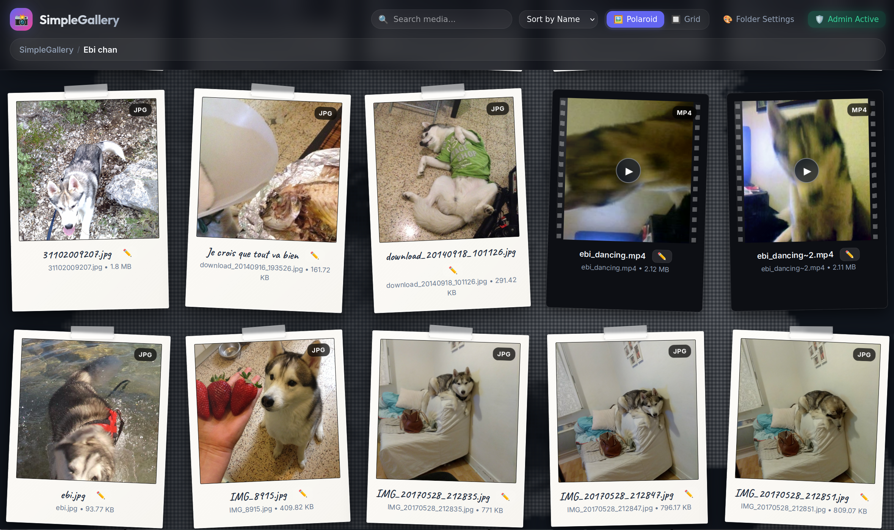

# SimpleGallery 🚀

**SimpleGallery** est une galerie web ultra-légère, ultra-rapide et moderne conçue en **PHP 8+ / JavaScript Vanilla** (sans frameworks lourds ni dépendances complexes).



Le principe fondamental du projet d'origine (2005) est conservé : **pour publier des nouveaux médias (photos, vidéos, musique, documents), il suffit simplement de les copier dans n'importe quel dossier sur le serveur.**

---

## ✨ Fonctionnalités Principales

- 🔄 **Orientation Automatique des Photos (EXIF)** :
  - Détection et orientation automatique à 100% des photos smartphone / appareils numériques (verticales / horizontales) via `image-orientation: from-image` en CSS3 et `exif_read_data` / `imagerotate` en PHP.
- 🔎 **Explorateur d'Images Interactif (Zoom & Déplacement)** :
  - **Zoom Avant / Arrière** : Via les boutons `➕` / `➖`, la molette de la souris, ou les touches clavier `+` / `-`.
  - **Déplacement à la souris (*Pan / Drag*)** : Glissez-déposez l'image à la souris ou au doigt pour explorer les détails.
  - **Double-Clic** : Alterne rapidement entre le zoom 1x et 2.5x centré.
  - **Rotation 90°** : Bouton `⟳` ou touche `R` pour pivoter les photos à la volée.
  - **Bouton Réinitialiser** : Recommencez le zoom à 100% via le bouton `🔄` ou la touche `0`.
- 📸 **Rendu Polaroid Ultra-Réaliste & Mode Grille** :
  - **Mode Polaroid** : Cartes style tirage argentique Polaroid 600 (marges authentiques, papier coquille d'œuf texturé, effet de reflet brillant, ruban adhésif *Washi Tape* translucide, inclinaisons naturelles et police d'encre manuscrite *Caveat*).
  - **Mode Grille** : Grille responsive épurée avec zoom au survol.
- ⚡ **Génération & Cache de Vignettes Intelligent** ([thumb.php](file:///home/oktail/Documents/GitHub/SimpleGallery/thumb.php)) :
  - **Photos** : Redimensionnement automatique via l'extension **PHP GD** avec gestion de la rotation EXIF. *Bascule automatique en stream direct si GD n'est pas installé*.
  - **Vidéos** : Extraction automatique d'une image poster (à 1.0s) via **FFmpeg** pour les fichiers `.mp4`, `.webm`, `.mov`, `.mkv`, etc.
  - Mise en cache automatique dans le dossier `.thumbnails/` au format WebP / JPEG optimisé.
- 🎬 **Support Média HTML5 Natif** : Lecture directe des vidéos et musiques dans le navigateur (zéro Flash).
- 📁 **Surcharge de Configuration par Fichiers Cachés (*Dotfiles Unix*)** : Personnalisez les commentaires, fonds d'écran, titres et thèmes par dossier via `.comment`, `.bg`, `.title`, `.desc`, `.theme`.
- 🎨 **Thèmes & Couleurs Configurables** : Sélection de thèmes (`polaroid-classic`, `dark-glass`, `light-minimal`, `cyberpunk`) ou couleurs sur mesure dans `config.php`.
- 🔍 **Recherche & Filtres en Temps Réel** : Filtrage instantané par type de média et barre de recherche.
- 🔐 **Mode Administrateur & Authentification** : Authentification sécurisée par mot de passe haché (BCRYPT) enregistré dans `config.php` via le script CLI `set_admin_password.php` ou l'interface web.
- 🔒 **Sécurité Renforcement** : Protection stricte contre le *Directory Traversal* (`../`).

---

## ⌨️ Raccourcis Clavier dans la Lightbox

| Raccourci | Action |
|---|---|
| `<Flèche Gauche>` / `<Flèche Droite>` | Élément précédent / suivant |
| `Swipe Gauche / Droite` (Mobile) | Navigation tactile fluide |
| `+` ou `=` | Zoom avant |
| `-` ou `_` | Zoom arrière |
| `Glisser Souris` | Déplacer l'image (*Pan / Drag*) |
| `Double Clic` | Basculer entre zoom 1x et 2.5x |
| `0` | Réinitialiser le zoom (100%) |
| `R` | Rotation de l'image de 90° |
| `F` | Basculer en mode Plein Écran (*Fullscreen*) |
| `Échap` | Fermer la visionneuse Lightbox |

---

## 🔐 Configuration du Mode Administration (`set_admin_password.php`)

SimpleGallery intègre un **mode administration** sécurisé pour déverrouiller des fonctionnalités de gestion.

### 1. Initialiser ou Modifier le Mot de Passe Admin via CLI

Exécutez la commande suivante dans votre terminal à la racine du projet pour générer et enregistrer le hash BCRYPT dans [config.php](file:///home/oktail/Documents/GitHub/SimpleGallery/config.php) :

```bash
php set_admin_password.php "VotreMotDePasseSecret"
```

### 2. Se Connecter et Modifier le Mot de Passe via l'Interface Web

- Cliquez sur le bouton **🔑 Admin** dans la barre d'outils de l'application.
- Saisissez votre mot de passe pour activer le mode **🛡️ Admin Active**.
- Vous pouvez ensuite modifier votre mot de passe directement depuis le formulaire du modal administration.

### 3. Désactiver le Mode Admin

Pour désactiver temporairement le mode administration, définissez la variable `$admin_password_hash` sur une chaîne vide dans `config.php` :

```php
$admin_password_hash = '';
```

### 4. Édition des Métadonnées & Dotfiles en Mode Admin

Lorsque le mode administration est actif (**🛡️ Admin Active**), l'édition se fait directement depuis l'interface web :

- **Titre du dossier (`.title`)** : Personnalisez le nom affiché du répertoire via le bouton **🎨 Folder Settings**.
- **Description du dossier (`.desc`)** : Éditez ou ajoutez une bannière descriptive en un clic (**✏️ Edit Banner**).
- **Fond (`.bg`) & Thème du dossier (`.theme`)** : Configurez la couleur/image de fond et le thème du dossier courant.
- **Légende des médias (`.comment`)** : Cliquez sur l'icône **✏️** au survol des cartes Polaroid/Grille ou dans la visionneuse Lightbox pour ajouter/modifier une légende (`fichier.jpg = Ma légende`).

> ℹ️ **Remarque** : Les noms réels des fichiers et répertoires physiques restent 100% inchangés sur le disque. Seuls les fichiers cachés (*Dotfiles*) `.title`, `.desc`, `.comment`, `.bg` et `.theme` du répertoire sont modifiés.

---

## 📂 Configuration par Fichiers Cachés (*Dotfiles Unix*)

SimpleGallery permet de personnaliser individuellement chaque dossier de la galerie en y créant de simples **fichiers texte cachés Unix** (*Dotfiles*, commençant par un point `.`). 

Ces fichiers peuvent être créés **manuellement avec n'importe quel éditeur de texte** ou enregistrés **automatiquement depuis l'interface web via le Mode Admin**.

---

### 📋 Tableau Synthétique des Dotfiles

| Fichier | Rôle & Fonctionnalité | Exemple Rapide |
|---|---|---|
| **`.title`** | Surcharge le nom d'affichage du dossier (en-tête, grille, fil d'Ariane). | `Vacances d'Été 2026` |
| **`.desc`** ou **`.description`** | Affiche une bannière descriptive élégante en haut de la galerie pour ce dossier. | `Album photo et vidéo de notre voyage en Espagne.` |
| **`.comment`** | Associe des commentaires ou légendes spécifiques aux fichiers du dossier. | `photo1.jpg = Souvenir à la plage` |
| **`.bg`** | Applique une image locale ou une couleur/dégradé CSS en fond d'écran. | `#0f172a` ou `fond.jpg` |
| **`.theme`** | Applique un thème de couleurs spécifique à ce répertoire. | `cyberpunk` |
| **`.private`** | Masque le dossier aux utilisateurs publics (visible uniquement par l'Admin). | *Fichier vide ou "private"* |
| **`.password`** | Protège le dossier par mot de passe (affiche un badge 🔒 et un formulaire). | *Hash BCRYPT* |

---

### 📝 Syntaxe et Exemples par Fichier

#### 1. Titre de Dossier Personnalisé (`.title`)
Permet de remplacer le nom réel du répertoire sur le disque par un titre d'affichage lisible avec espaces et accents.
- **Chemin** : `mon_dossier/.title`
- **Contenu** :
  ```text
  Vacances à la Montagne 🏔️
  ```

#### 2. Bannière Descriptive (`.desc` ou `.description`)
Affiche une bannière d'information au-dessus de la grille de médias.
- **Chemin** : `mon_dossier/.desc`
- **Contenu** :
  ```text
  Retrouvez ici toutes les photos et vidéos prises lors de notre séjour au ski en février 2026.
  ```

#### 3. Commentaires et Légendes Médias (`.comment`)
Associe une légende personnalisée sous les Polaroids, les cartes de la grille et dans la visionneuse Lightbox.

- **Chemin** : `mon_dossier/.comment`
- **Format Recommandé (Clé = Valeur)** :
  ```text
  photo1.jpg = Souvenir de la randonnée en altitude
  video_ski.mp4 = Descent en snowboard à toute vitesse !
  IMG_2026.JPG = Soirée raclette au chalet
  ```
- **Format Legacy 2005 (Nom de fichier suivi du texte sur la ligne suivante)** :
  ```text
  photo1.jpg
  Souvenir de la randonnée en altitude
  video_ski.mp4
  Descent en snowboard à toute vitesse !
  ```

#### 4. Fond d'Écran Personnalisé (`.bg`)
Permet de définir un fond d'écran unique pour le dossier (image locale ou style CSS).
- **Chemin** : `mon_dossier/.bg`
- **Exemple 1 (Image locale dans le dossier)** :
  ```text
  fond_montagne.jpg
  ```
- **Exemple 2 (Couleur Unie CSS)** :
  ```text
  #0f172a
  ```
- **Exemple 3 (Dégradé CSS)** :
  ```text
  linear-gradient(135deg, #0f172a 0%, #1e1b4b 100%)
  ```

#### 5. Thème de Couleur Dédié (`.theme`)
Permet d'appliquer un thème visuel spécifique uniquement pour ce dossier.
- **Chemin** : `mon_dossier/.theme`
- **Option A (Nom d'un thème prédéfini)** :
  ```text
  cyberpunk
  ```
  *(Thèmes disponibles : `polaroid-classic`, `dark-glass`, `light-minimal`, `cyberpunk`)*

- **Option B (Surcharge de couleurs sur mesure en clé=valeur)** :
  ```text
  accent = #ec4899
  polaroid_bg = #fef08a
  bg_main = #0d0221
  ```

#### 6. Dossier Masqué / Privé (`.private` ou nom de dossier `private`)
Masque automatiquement le dossier aux visiteurs publics. Il reste visible et accessible **uniquement en Mode Admin**.
- **Chemin** : `mon_dossier/.private`
- **Fonctionnement** : Par défaut, tout dossier nommé `private` ou contenant un fichier `.private` est exclu des résultats API et masqué de l'interface pour les utilisateurs non authentifiés.

#### 7. Dossier Protégé par Mot de Passe (`.password`)
Affiche le dossier publiquement avec un badge **🔒 Protégé** mais exige la saisie d'un mot de passe pour ouvrir le dossier et afficher ses photos/vidéos.
- **Chemin** : `mon_dossier/.password`
- **Contenu** : Contient un hash BCRYPT du mot de passe du dossier (généré automatiquement via l'interface Admin).
- **Re-verrouillage (`🔒 Lock Folder`)** : Lorsqu'un visiteur déverrouille un dossier pour sa session, un bouton **🔒 Lock Folder** apparaît dans la bannière supérieure, lui permettant de fermer/re-verrouiller la session à tout moment.

---

### 🛡️ Édition Automatique depuis le Mode Admin

Lorsque le **Mode Admin** est déverrouillé (**🛡️ Admin Active**) :
- Les paramètres d'accès (**🌐 Public**, **👁️‍🗨️ Masqué/Admin**, **🔒 Protégé par mot de passe**), le titre (`.title`), la description (`.desc`), le fond (`.bg`) et le thème (`.theme`) s'éditent facilement depuis le modal **🎨 Folder Settings**.
- Le fichier `.comment` s'édite en cliquant sur l'icône **✏️ Edit Legend** sur chaque carte ou dans la visionneuse Lightbox.
- Le serveur met à jour les fichiers cachés automatiquement **sans jamais renommer ni altérer vos fichiers et dossiers originaux**.

---

## 🎨 Configuration du Thème (`config.php`)

Dans [config.php](file:///home/oktail/Documents/GitHub/SimpleGallery/config.php), vous pouvez choisir un thème global ou ajuster les paramètres :

```php
// Sélection du thème global ('polaroid-classic', 'dark-glass', 'light-minimal', 'cyberpunk')
$theme_preset = 'polaroid-classic';

// Titre par défaut de la galerie
$gallery_title = "SimpleGallery";

// Dimensions maximales des vignettes (en pixels)
$thumb_width = 360;
$thumb_height = 360;
```

---

## 🛠️ Structure du Projet

```text
SimpleGallery/
├── config.php            # Configuration générale (thèmes, titre, hash admin)
├── api.php               # API REST JSON PHP (scan des répertoires, dotfiles & auth admin)
├── thumb.php             # Moteur de vignettes (GD, FFmpeg, cache .thumbnails & stream direct)
├── set_admin_password.php # Script CLI pour générer/mettre à jour le mot de passe admin
├── index.php             # Application Web HTML5 SPA (interface principale & modal admin)
├── css/
│   └── gallery.css       # Style CSS3, effet Polaroid réaliste, grille & modal admin
├── js/
│   └── gallery.js        # Logique client (moteur de zoom/déplacement, AJAX, Lightbox, auth admin)
└── .thumbnails/          # Dossier de cache des vignettes (créé automatiquement)
```

---

## 💻 Installation & Permissions

1. Copiez les fichiers de **SimpleGallery** sur votre serveur web PHP (compatible Apache, Nginx, LiteSpeed, Caddy avec PHP 7.4+ ou PHP 8+).
2. Optionnel : activez l'extension PHP `gd` pour le redimensionnement d'images et installez `ffmpeg` pour l'extraction de vignettes vidéo.
3. Définissez le mot de passe d'administration via la commande CLI :
   ```bash
   php set_admin_password.php "VotreMotDePasse"
   ```
4. **Permissions d'écriture** (Nécessaire pour que le mode Admin puisse enregistrer les Dotfiles `.title`, `.desc`, `.comment`, `.bg`, `.theme`) :
   Accordez les droits d'écriture à l'utilisateur du serveur web (`http`, `www-data` ou `nginx`) sur les dossiers de la galerie :
   ```bash
   # Exemple de commande sous Linux / Apache / Nginx :
   chown -R www-data:www-data /path/to/SimpleGallery
   chmod -R 775 /path/to/SimpleGallery
   ```
5. Glissez vos dossiers de photos et médias directement dans le répertoire.
6. Ouvrez `index.php` dans votre navigateur web !

---

## 📄 Licence
[MIT License](LICENSE)
