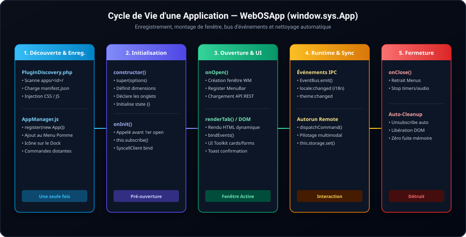

# 🛠️ Guide Développeur — Création d'Applications WebOS

Ce guide vous accompagne pas-à-pas pour concevoir, intégrer et publier une application modulaire dans **SimpleGallery WebOS**.

---

## 1. Structure Standard d'une Application

Toute application réside dans son propre sous-dossier au sein de `apps/` :

```text
apps/mon-outil/
├── manifest.json       # OBLIGATOIRE — Déclaration d'identité, fenêtre, commandes
├── app.js              # OBLIGATOIRE — Logique JavaScript (héritant de WebOSApp)
├── style.css           # (Recommandé) — Styles CSS isolés
├── api.php             # (Optionnel) — Backend PHP privé
├── template.php        # (Optionnel) — Fragment HTML pré-rendu
└── locales/            # (Recommandé) — Dictionnaires i18n
    ├── fr.json
    ├── en.json
    └── ja.json
```

---

## 2. Le Fichier `manifest.json`

Le manifeste permet à `PluginDiscovery` et à l'`AppManager` de cataloguer l'application :

```json
{
  "id": "mon-outil",
  "name": "Mon Outil",
  "version": "1.0.0",
  "description": "Application utilitaire pour SimpleGallery WebOS",
  "icon": "⚡",
  "category": "utilities",
  "enabled_by_default": true,
  "autostartCapable": true,
  "entry": {
    "js": "app.js",
    "css": "style.css",
    "template": "template.php"
  },
  "window": {
    "title": "Mon Outil",
    "width": 800,
    "height": 560,
    "minWidth": 480,
    "minHeight": 320,
    "resizable": true,
    "maximizable": true
  },
  "commands": {
    "refresh": {
      "description": "Rafraîchir les données",
      "params": []
    }
  },
  "locales": {
    "fr": { "title": "Mon Outil", "description": "Application utilitaire" },
    "en": { "title": "My Tool", "description": "Utility application" },
    "ja": { "title": "ツール", "description": "ユーティリティアプリ" }
  }
}
```

### Options Utiles :
- `"enabled_by_default": false` : Indispensable pour des modules spécialisés, des extensions de maintenance ou des apps privées ne devant pas encombrer le bureau par défaut.
- `"category"` : Détermine le groupement (`media`, `productivity`, `utilities`, `games`, `system`).
- `"commands"` : Déclare des actions pilotables à distance (utilisées par le moteur **Autorun**).

---

## 3. Classe de Base `WebOSApp` (`window.sys.App`)

Hériter de `WebOSApp` permet de bénéficier automatiquement du cycle de vie des fenêtres, de la gestion des onglets, du nettoyage d'événements et des services du système.



```javascript
(function(window) {
  'use strict';

  class MonOutilApp extends (window.sys && window.sys.App || window.WebOSApp) {
    constructor() {
      super({
        id: 'mon-outil',
        title: 'apps.mon-outil.title',
        icon: '⚡',
        width: 800,
        height: 560,
        tabs: [
          { id: 'main',     label: 'mon_outil.tab_main', icon: '📋' },
          { id: 'settings', label: 'mon_outil.tab_cfg',  icon: '⚙️' }
        ],
        state: {
          items: [],
          isLoading: false
        }
      });
    }

    /** Appelé une seule fois à l'initialisation */
    onInit() {
      // Écoute automatique nettoyée à la destruction
      this.subscribe('theme:changed', (theme) => {
        this.onThemeChanged(theme);
      });
    }

    /** Appelé à l'ouverture de la fenêtre */
    onOpen() {
      this.registerMenus();
      this.loadData();
    }

    /** Rendu du contenu selon l'onglet actif */
    renderTab(tabId) {
      if (tabId === 'main') {
        return `
          <div class="mon-outil-content" style="padding:16px;">
            ${window.sys.ui.card({
              title: this.t('mon_outil.items_title'),
              icon: '📦',
              content: `<div id="itemsContainer">${this.renderItemsList()}</div>`
            })}
          </div>
        `;
      }
      return `<p style="padding:16px;">${this.t('mon_outil.settings_content')}</p>`;
    }

    renderItemsList() {
      if (!this.state.items.length) {
        return `<p style="color:var(--text-muted);">${this.t('mon_outil.empty')}</p>`;
      }
      return this.state.items.map(item => `
        <div class="item-row">${this.escapeHtml(item.name)}</div>
      `).join('');
    }

    /** Liaison des interactions utilisateurs */
    bindEvents(container) {
      super.bindEvents(container);

      window.sys.ui.bindActions(container, {
        'click #refreshBtn': () => this.loadData()
      });
    }

    async loadData() {
      try {
        const res = await this.api.get('get_gallery');
        if (res && res.success) {
          this.state.items = res.files || [];
          const container = document.getElementById('itemsContainer');
          if (container) container.innerHTML = this.renderItemsList();
        }
      } catch (err) {
        this.toast.error(this.t('mon_outil.error_load'));
      }
    }

    registerMenus() {
      if (!window.MenuBarManager) return;
      window.MenuBarManager.registerAppMenus('mon-outil', [
        {
          id: 'file',
          label: 'Fichier',
          items: [
            { id: 'refresh', label: '🔄 Rafraîchir', action: () => this.loadData() },
            { separator: true },
            { id: 'close', label: 'Fermer', action: () => this.close() }
          ]
        }
      ]);
    }
  }

  // Enregistrement auprès du gestionnaire d'applications
  if (window.sys && window.sys.appManager) {
    window.sys.appManager.register(new MonOutilApp());
  }

})(window);
```

---

## 4. Services et Outils Userland Disponibles

| Service | Accès | Description |
|---|---|---|
| **Appels API** | `this.api` / `this.appApi` | Instance pré-configurée de `SyscallClient` avec gestion automatique du jeton CSRF. |
| **Stockage Namespacé** | `this.storage` | Accès `localStorage` isolé sous `webos_app_<id>_<key>` (`get`, `set`, `remove`). |
| **Notifications Toast** | `this.toast` | `this.toast.success()`, `.error()`, `.info()`, `.warning()`. |
| **Traduction i18n** | `this.t('cle', { params })` | Traduction réactive dans la langue active (FR, EN, JA). |
| **Bus IPC** | `this.subscribe(event, cb)` | Écoute d'événements système/inter-apps avec désinscription automatique à la fermeture. |
| **Toolkit UI** | `window.sys.ui` | Générateur de cartes (`card`), dialogues (`dialog`), formulaires (`switch`, `input`). |

---

## 5. Règles d'Architecture Strictes

> [!CAUTION]
> 1. **Pas de `fetch()` nu** : Toujours utiliser `this.api.get()` ou `this.api.post()` afin de garantir la présence des headers de sécurité et du token CSRF.
> 2. **Pas de chaînage de repli hardcodé dans `this.t()`** :
>    - ❌ `this.t('app.label') || 'Par défaut'`
>    - ✅ `this.t('app.label')` (laisse l'i18n retourner la clé brute si non traduite pour faciliter le débogage).
> 3. **Nettoyage automatique** : Ne pas attacher d'écouteurs globaux sur `window` sans les détacher dans `onClose()`.
