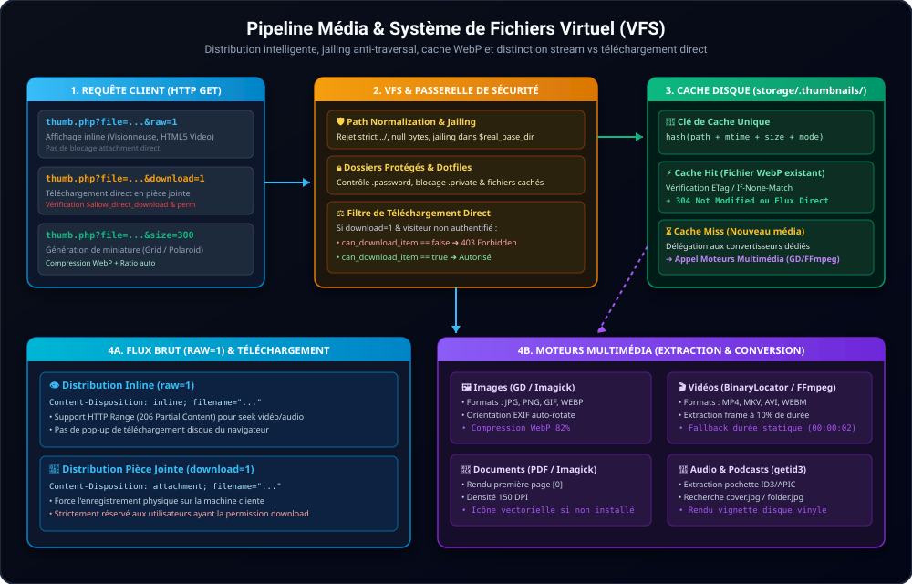

# 🏗️ Architecture Système — SimpleGallery WebOS

Ce document détaille l'architecture interne de **SimpleGallery WebOS**, la répartition des responsabilités entre le serveur (Kernel PHP) et le client (Userland JavaScript), ainsi que le cycle de vie des données et des requêtes.

---

## 1. Vue d'Ensemble & Découpage

SimpleGallery adopte une architecture **Micro-Kernel + Userland** :
- **Serveur (Kernel PHP 7.4+ / 8.x)** : Zéro framework lourd, zéro base de données obligatoire. Il gère l'isolation du système de fichiers (VFS), l'authentification BCRYPT, la protection CSRF, la génération de miniatures (GD / FFmpeg) et le dispatching des appels API.
- **Navigateur (Userland Vanilla JS / CSS3)** : Environnement multi-tâches avec gestionnaire de fenêtres (`WindowManager`), barre supérieure dynamique façon macOS (`MenuBarManager`), bus d'événements IPC (`EventBus`), client d'appels système (`SyscallClient`), internationalisation réactive en temps réel (`I18nEngine`) et toolkit UI déclaratif.

---

## 2. Points d'Entrée HTTP & Routing

| Point d'Entrée | Rôle | Sécurité / Comportement |
|---|---|---|
| `index.php` | Shell HTML du bureau WebOS | Injecte le DOM racine, les variables de thème, le token CSRF et charge les scripts découverts. |
| `system/endpoints/api.php` | Passerelle API REST / Syscall | Vérifie le jeton CSRF sur toutes les actions mutantes (`POST`), dispatche via `ActionRouter`. |
| `system/endpoints/thumb.php` | Moteur de distribution média et miniatures | Sert les flux bruts (`raw=1`), les téléchargements (`download=1`) et calcule les vignettes GD/FFmpeg en cache. |
| `system/endpoints/archive.php` | Générateur d'archives à la volée | Crée des ZIP/TAR en streaming à la demande pour un sous-dossier sélectionné. |
| `apps/<id>/api.php` | API privée optionnelle d'application | Endpoint autonome géré par `AppEndpoint::handle()` pour les besoins spécifiques d'une app. |

---

## 3. Découplage Fondamental : `config/` vs `storage/`

Le projet sépare strictement la configuration système des données applicatives modifiables au runtime :

| Dossier | Contenu | Qui l'administre | Exemples |
|---|---|---|---|
| **`config/`** | Configuration **statique & système** | Administrateur / déploiement | `config.php`, `security.php`, `mime_types.php`, `themes.php`, `desktop.json` |
| **`storage/`** | Données **dynamiques & runtime** | Système et applications | `storage/.thumbnails/`, `storage/session/`, `storage/disabled_apps.json`, `storage/autostart.json` |

> [!IMPORTANT]
> **Règle d'or pour les applications** :
> Une application ne doit **jamais** écrire dans `config/`. Toutes ses données persistantes doivent être stockées dans `storage/` ou via son propre sous-répertoire applicatif (`storage/apps/<id>/`).

---

## 4. Système de Découverte Dynamique (`PluginDiscovery`)

SimpleGallery ne possède aucun registre d'applications codé en dur :
1. Au démarrage, `SimpleGallery\Kernel\PluginDiscovery::getDiscoveredApps()` scanne le dossier `apps/` (ainsi que les sous-dossiers de niveau 1 comme `apps/games/*` ou `apps/ffs-apps/*`).
2. Pour chaque sous-dossier contenant un `manifest.json` ou un fichier `<nom>.js` / `app.js` :
   - Les scripts auxiliaires (`manifest.scripts`) et le script principal (`manifest.entry.js` ou `app.js`) sont indexés.
   - La feuille de style (`manifest.entry.css` ou `style.css`) est indexée.
   - Les traductions locales (`apps/<id>/locales/*.json`) sont agrégées.
3. **Filtrage des applications désactivées** :
   `PluginDiscovery::getDisabledAppIds()` résout la liste selon la priorité :
   1. `storage/disabled_apps.json` (modifié via le panneau Paramètres).
   2. Variable `$disabled_apps` dans `config/config.php`.
   3. Fichier optionnel `config/disabled_apps.json`.
   4. Propriété déclarative `"enabled_by_default": false` dans le `manifest.json` de l'application.

---

## 5. Virtual File System (VFS) & Isolation

Le système de fichiers virtuel ([system/kernel/FS/](file:///c:/Users/ec135/AndroidStudioProjects/SimpleGallery/system/kernel/FS)) isole l'utilisateur du système hôte :
- **Sandboxing strict** : Tout chemin d'accès relatif est résolu via `realpath()` et doit obligatoirement résider sous `$real_base_dir` (`storage/media` par défaut).
- **Protection contre le Directory Traversal** : Toute tentative d'évasion (`../`, chemins absolus Windows/Unix, encodages nuls `%00`) est rejetée avec une erreur 403 ou 404.
- **Gestion des Dotfiles Unix** : Les fichiers de configuration locaux (`.title`, `.desc`, `.comment`, `.bg`, `.theme`, `.private`, `.password`) sont interprétés par le VFS et protégés contre l'accès direct en lecture par le serveur web via `.htaccess`.
