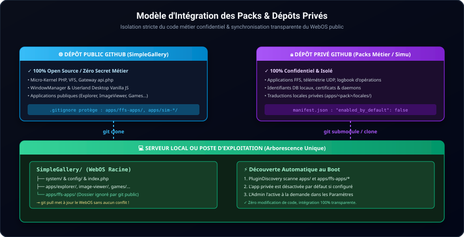

# 🔒 Intégration de Modules Métier & Dépôts Privés

Ce guide détaille la méthode recommandée pour enrichir **SimpleGallery WebOS** avec des applications métiers confidentielles, industrielles ou propriétaires, tout en maintenant le dépôt de base parfaitement synchronisé avec les évolutions publiques.

---

## 1. Principe d'Architecture

SimpleGallery est conçu pour être extensible **sans altération du noyau** :
- Le composant `PluginDiscovery` explore automatiquement tous les dossiers placés dans `apps/` (ainsi que les sous-dossiers de niveau 1 comme `apps/mon-pack/*`).
- Les applications peuvent s'auto-déclarer désactivées par défaut via leur `manifest.json`.
- Le fichier `.gitignore` racine permet d'isoler un ou plusieurs dossiers d'applications privées.

---

## 2. Organisation en Dépôt Git Séparé

> [!CAUTION]
> Sur GitHub, **une branche ne peut pas être privée au sein d'un dépôt public**. Pour conserver du code propriétaire ou confidentiel, ce code doit résider dans un dépôt privé distinct.



### Structure Recommandée sur la Machine de Déploiement :

```text
SimpleGallery/                     (Dépôt Public GitHub)
├── system/
├── config/
├── apps/
│   ├── explorer/
│   ├── image-viewer/
│   └── mon-pack-prive/            (Dépôt Privé GitHub distinct)
│       ├── .git/
│       ├── app-metier-1/
│       │   ├── manifest.json
│       │   └── app.js
│       └── app-metier-2/
│           ├── manifest.json
│           └── app.js
```

### Étape 1 — Ignorer le dossier dans le `.gitignore` public

Dans le fichier [.gitignore](file:///c:/Users/ec135/AndroidStudioProjects/SimpleGallery/.gitignore) racine du WebOS :
```gitignore
# Dossiers d'applications privées / sous-dépôts
apps/mon-pack-prive/
apps/ffs-apps/
apps/sim-*/
```

### Étape 2 — Cloner le dépôt privé dans `apps/`

```bash
cd apps/
git clone git@github.com:votre-organisation/mon-pack-prive.git
```

`PluginDiscovery` détecte instantanément toutes les applications situées à l'intérieur de `apps/mon-pack-prive/` et les charge dans l'environnement WebOS sans aucune configuration supplémentaire.

---

## 3. Déclaration d'Applications Désactivées par Défaut

Pour éviter qu'une application métier spécialisée (ou un outil de maintenance) n'apparaisse automatiquement sur le bureau de tous les utilisateurs :

Dans le fichier `manifest.json` de votre application :
```json
{
  "id": "mon-app-metier",
  "name": "Supervision Métier",
  "enabled_by_default": false,
  "category": "system",
  "entry": {
    "js": "app.js",
    "css": "style.css"
  }
}
```

Grâce à `"enabled_by_default": false` :
- L'application est masquée du lanceur d'applications et du bureau par défaut.
- Un administrateur peut l'activer au cas par cas depuis le panneau **Paramètres > Applications** du WebOS.
- Aucun nom d'application privée n'a besoin d'être codé en dur dans le noyau `system/kernel/PluginDiscovery.php`.

---

## 4. Isolation des Traductions (i18n)

Chaque application doit gérer ses propres traductions localement dans son propre sous-dossier `locales/` :

```text
apps/mon-pack-prive/app-metier/
└── locales/
    ├── fr.json
    ├── en.json
    └── ja.json
```

Format d'un fichier `locales/fr.json` :
```json
{
  "translations": {
    "app_metier.title": "Supervision",
    "app_metier.status_ok": "Tous les systèmes sont opérationnels"
  }
}
```

Ces traductions sont automatiquement fusionnées dans le dictionnaire global au chargement de l'application, sans jamais modifier les fichiers de langues principaux du WebOS ([locales/fr.json](file:///c:/Users/ec135/AndroidStudioProjects/SimpleGallery/locales/fr.json), etc.).
