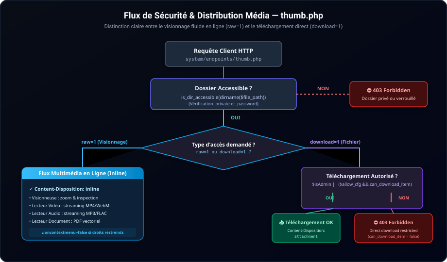

# 🔐 Modèle de Sécurité & Gestion des Permissions — SimpleGallery

Ce document explicite les politiques de sécurité, le modèle de droits et la distinction essentielle entre la **consultation en ligne** et le **téléchargement direct de fichiers**.

---

## 1. Principes Directeurs

SimpleGallery est conçu pour être déployable sur un hébergement mutualisé ou un serveur dédié sans base de données, tout en assurant une isolation complète contre les attaques web classiques :
- **Protection CSRF Globale** : Un jeton unique cryptographique est généré par session et validé sur chaque requête POST (`X-CSRF-Token`).
- **Sandboxing & Anti-Directory Traversal** : Aucun chemin ne peut pointer hors du dossier racine média (`$real_base_dir`).
- **Filtrage des Extensions Dangereuses** : Les extensions exécutables (`.php`, `.phtml`, `.phar`, `.sh`, `.bat`, `.exe`, `.cgi`, `.sql`, `.ini`) sont strictement bloquées en lecture, écriture et upload.
- **Protection Anti-SSRF** : Le proxy média et les téléchargeurs distants vérifient la résolution DNS pour bloquer les adresses IP privées (RFC 1918), loopback (`127.0.0.1`), IPv6 link-local et services de métadonnées cloud (`169.254.169.254`).
- **Sanitisation SVG** : Les fichiers vectoriels SVG subissent un nettoyage strict supprimant les balises `<script>`, `<iframe>` et les gestionnaires d'événements `onload/onclick`.

---

## 2. Visionnage en Ligne vs Téléchargement de Fichier

Pour concilier la protection des droits d'auteur et l'expérience utilisateur, SimpleGallery distingue deux modes d'accès aux médias :

### 👁️ Mode 1 : Visionnage / Streaming en Ligne (`raw=1`)
- Utilisé par la **Visionneuse d'images**, le **Lecteur Vidéo HTML5**, le **Lecteur Audio** et le **Visualiseur PDF**.
- **Comportement** : Dès lors que le dossier est public ou déverrouillé, le flux est servi avec l'en-tête HTTP `Content-Disposition: inline`.
- Le média s'affiche de manière fluide et transparente dans l'interface sans créer de fichier téléchargé sur le disque de l'utilisateur.

### 💾 Mode 2 : Téléchargement Direct en Pièce Jointe (`download=1` ou `attachment=1`)
- Utilisé par les boutons explicites "Télécharger l'image", "Télécharger l'archive ZIP", etc.
- **Comportement** : Ce mode applique strictement la politique de permissions :
  - Autorisé si l'utilisateur est administrateur.
  - Autorisé pour les visiteurs uniquement si `$allow_direct_download = true` dans `config/config.php` **ET** que la permission `can_download_item` est accordée.
  - Bloqué par un `403 Forbidden` si l'option est désactivée.

---

## 3. Matrice des Permissions Invités

Dans [config/security.php](file:///c:/Users/ec135/AndroidStudioProjects/SimpleGallery/config/security.php), l'administrateur peut affiner les droits des utilisateurs non authentifiés :

| Permission | Clé | Valeur par défaut | Effet si `false` |
|---|---|:---:|---|
| **Téléversement** | `can_upload` | `false` | La zone de drop et le bouton d'upload sont verrouillés. |
| **Suppression** | `can_delete` | `false` | Les options de suppression sont invisibles et rejetées par l'API. |
| **Déplacement / Renommage** | `can_move` | `false` | Le glisser-déposer de réorganisation est désactivé. |
| **Commentaires & Légendes** | `can_comment` | `false` | L'édition des métadonnées et fichiers `.comment` est verrouillée. |
| **Création de Dossier** | `can_create_folder` | `false` | Le bouton "Nouveau dossier" est masqué. |
| **Téléchargement d'Archive** | `can_download_archive` | `false` | Le menu de création/téléchargement de ZIP est masqué. |
| **Téléchargement de Fichier** | `can_download_item` | `false` | Empêche le clic droit / download explicite, active `nodownload` sur les vidéos. |

---

## 4. Protection Anti-Clic Droit Côté Interface

Lorsque `can_download_item` est désactivé :
1. **Sur les vidéos** : L'attribut `controlsList="nodownload"` est automatiquement injecté sur la balise `<video>`, retirant l'option de téléchargement du menu natif du navigateur.
2. **Sur les images** : L'événement de menu contextuel est intercepté (`oncontextmenu="return false;"`), empêchant l'apparition triviale de l'option *"Enregistrer l'image sous..."*.
3. Les boutons de téléchargement direct sont masqués dans les barres d'outils des applications.

---

## 5. Protection des Dossiers par Dotfiles

SimpleGallery supporte deux niveaux de restriction par dossier sans aucune base de données :

- **Dossier Privé (`.private`)** :
  - Placez un fichier nommé `.private` dans un sous-dossier.
  - Le dossier et tous ses sous-dossiers deviennent **invisibles et inaccessibles** pour les visiteurs publics (404/403).
  - Seul un administrateur connecté peut les voir et les explorer.
- **Dossier Protégé par Mot de Passe (`.password`)** :
  - Contient un hachage BCRYPT du mot de passe attendu.
  - Le visiteur est invité à saisir le mot de passe via un dialogue sécurisé pour déverrouiller la session sur ce dossier.
